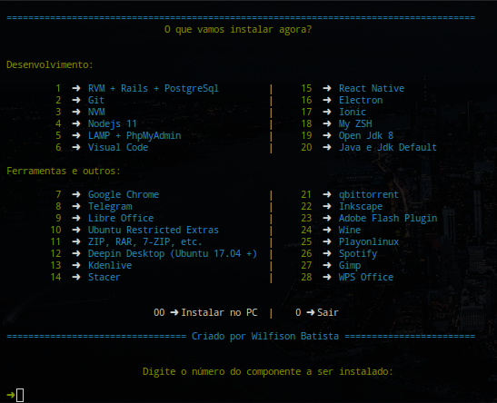

# AppsInstall
### Shell Script for automating the Web development environment on Ubuntu and Linux Mint





## Installation:


1. Run the command below in a terminal:

```shell
curl -s https://raw.githubusercontent.com/Wilfison/AppsInstall/master/install.sh | bash -s
```

2. Wait for the installation to finish

3. If everything goes well you can find `App Install` in your application menu

## How to use

1. After installing, look for `App Install` in your applications menu or run `devinstall` in a terminal

2. Choose from the menu pressing `space` in keyboard or mouse click and press `enter` to confirm.

3. Wait for the success message to install another app or press `cancel` to exit the app.

##  Attention

#### Script only tested on distributions:
- Ubuntu >= 20.04
- Linux Mint >= 20
