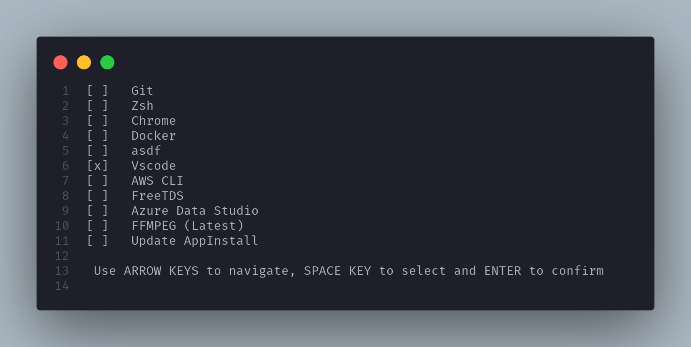

# AppsInstall

## Shell Script for automating my Web development environment on Ubuntu and Linux Mint



## Attention

This script is for debian/ubuntu based distributions, it was tested on Ubuntu 22.04 and Linux Mint 21.+, but it should work on other debian based distributions.

## Installation

1 - Run the command below in a terminal:

```shell
curl -s https://raw.githubusercontent.com/wilfison/AppsInstall/master/install.sh | bash -s
```

2 - Wait for the installation to finish.

## How to use

1 - After installing, run `devinstall` in a terminal

2 - Choose from the menu pressing `space` in keyboard or mouse click and press `enter` to confirm.

3 - Wait for the success message to install another app or press `CTRL + C` to exit the app.
